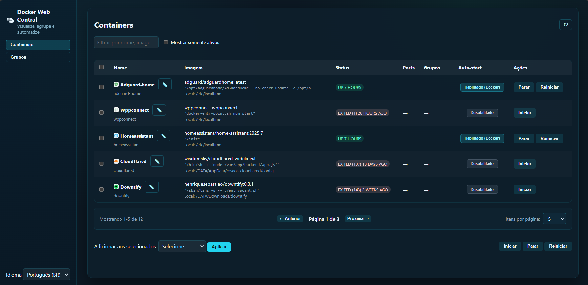

# Docker Web Control

**Web UI to manage Docker containers with visual cards, grouping, auto-start, aliases/icons, icon upload, filters, and start/stop/restart actions.**


## 📸 Screenshots



## ✨ Features

- 🐳 **Docker Container Management**: Start, stop, restart and delete containers
- 🎴 **Visual Cards**: Group cards + standalone container cards
- ↕ **Card Ordering**: Organize cards via drag-and-drop (saved like aliases/icons)
- 🌄 **Optional Bing Background**: Enable Bing daily wallpaper as the page background
- 📦 **Group Management**: Create groups, add/remove containers, batch actions
- 🚀 **Auto-start Configuration**: Set containers or groups to start automatically (updates restart policy)
- 🏷️ **Aliases & Icons**: Custom names and icons for containers and groups
- 📤 **Icon Upload**: Upload custom icon images (PNG, JPG, SVG, etc.) with automatic storage
- 🧱 **Create Containers**: Create via Dockerfile or via CLI command
- 📦 **Export**: Export containers/groups as ZIP
- 🔄 **Refresh**: Refresh button to update container status
- 🔍 **Filters**: Search by name, image, or group; show only running containers
- 🌐 **Multi-language**: Support for Portuguese (BR) and English
- 🎨 **Modern UI**: Clean, responsive design with dark mode support

## 📋 Requirements

- **Docker**: Must be installed and running
- **Python 3.10+**: For the backend server
- **Docker permissions**: User must be in the `docker` group
- **Dependencies**: No external Python dependencies required

## 🚀 Quick Start

Docker Web Control offers two installation modes to suit different needs:

### Option 1: Development/Custom Installation (Current Directory)

Perfect for development, testing, or custom locations:

```bash
git clone https://github.com/mathiasvinicius/docker-web-control.git
cd docker-web-control
./install.sh
./server.py  # or ./restart.sh
```

Access at: `http://localhost:8088`

### Option 2: System-wide Installation (Recommended for Production)

Install to `/opt/docker-web-control` with automatic systemd service setup:

```bash
git clone https://github.com/mathiasvinicius/docker-web-control.git
cd docker-web-control
sudo ./install.sh --system
```

The system-wide installer will:
- ✅ Copy all files to `/opt/docker-web-control`
- ✅ Generate systemd service files with correct paths
- ✅ Offer to install and enable services
- ✅ Optionally start services immediately

Access at: `http://localhost:8088`

## 🔄 Updating

To update an existing installation to the latest version:

```bash
cd docker-web-control
git pull
sudo ./install.sh --update
```

The update mode will:
- ✅ Detect your installation automatically
- ✅ Update all code files (server.py, static files, etc.)
- ✅ Preserve your configuration (.env)
- ✅ Preserve your data (groups, aliases, icons)
- ✅ Restart the service if it's running

No need to reconfigure - just pull and update!

## ⚙️ Configuration

Edit the `.env` file to customize settings:

`server.py` and `autostart.py` load `.env` automatically (without overriding existing environment variables).

```bash
# Server Configuration
HOST=0.0.0.0      # Listen on all interfaces
PORT=8088         # Web interface port

# Docker Configuration
DOCKER_TIMEOUT=30 # Timeout for Docker commands (seconds)

# Debug Mode (optional)
# DEBUG=1         # Enable debug logging
```

## 🔧 Systemd Service Management

### Automatic Installation (Recommended)

When using `sudo ./install.sh --system`, the installer offers interactive prompts to:

1. Generate service files with correct paths automatically
2. Install services to `/etc/systemd/system/`
3. Enable services to start on boot
4. Start services immediately

### Manual Service Management

If you chose system-wide installation, manage the service with:

```bash
# Start the service
sudo systemctl start docker-web-control

# Stop the service
sudo systemctl stop docker-web-control

# Restart the service
sudo systemctl restart docker-web-control

# Check status
sudo systemctl status docker-web-control

# View logs
sudo journalctl -u docker-web-control -f

# Enable on boot
sudo systemctl enable docker-web-control

# Disable on boot
sudo systemctl disable docker-web-control
```

### For Custom Installations

If you installed in a custom directory and want systemd services:

```bash
# Run the installer in system mode from your git clone directory
cd /path/to/docker-web-control
sudo ./install.sh --system
```

## 📡 API Endpoints

### Containers

- `GET /api/containers` - List all containers
- `POST /api/containers/{id}/start` - Start a container
- `POST /api/containers/{id}/stop` - Stop a container
- `POST /api/containers/{id}/restart` - Restart a container
- `POST /api/containers/{id}/restart-policy` - Update restart policy

### Groups

- `GET /api/groups` - List all groups
- `POST /api/groups` - Save groups configuration
  - `aliases` entries can include: `alias`, `icon`, and `order` (integer)

### Auto-start

- `GET /api/autostart` - Get auto-start configuration
- `POST /api/autostart` - Update auto-start configuration

### Container Aliases

- `GET /api/container-aliases` - List container aliases
- `POST /api/container-aliases` - Save container aliases
  - `aliases` entries can include: `alias`, `icon`, and `order` (integer)

## ↕ Card Ordering

Use the `↕ Organizar` button to enable drag-and-drop mode, then drag cards to rearrange them.
The order is saved automatically and persists across reloads.

### Icon Upload

- `POST /api/upload-icon` - Upload an icon image (multipart/form-data)
  - Accepts: PNG, JPG, JPEG, GIF, SVG, WEBP, ICO
  - Max size: 5MB
  - Returns: `{"url": "/icons/filename.ext", "filename": "filename.ext"}`

### Static Files

- `GET /static/*` - Serve static assets (CSS, JS, translations)
- `GET /icons/*` - Serve uploaded icon images

## 🖼️ Icon Management

### Uploading Icons

You can add custom icons to containers and groups in two ways:

1. **URL Method**: Enter an external icon URL directly in the icon field
2. **Upload Method**: Click the "📤 Upload" button to upload an image file

**Supported formats**: PNG, JPG, JPEG, GIF, SVG, WEBP, ICO
**Maximum file size**: 5MB

Uploaded icons are stored in the `icons/` directory and are automatically served by the application.

### Using Icons

1. Click the edit (✏️) button next to a container or group name
2. Enter an alias (optional)
3. Either enter an icon URL or click "📤 Upload" to upload an image
4. Click "Salvar" (Save) to apply changes

Icons will appear next to container and group names throughout the interface.

## 🛠️ Project Structure

```
docker-web-control/
├── server.py                    # Main Python backend server
├── autostart.py                 # Auto-start script
├── install.sh                   # Installation script
├── restart.sh                   # Server restart script
├── uninstall.sh                 # Uninstall script
├── requirements.txt             # Python dependencies
├── .env.example                 # Example configuration file
├── index.html                   # Main HTML interface
├── static/
│   ├── app.js                   # Frontend JavaScript
│   ├── styles.css               # CSS styles
│   └── translations.json        # i18n translations
├── data/                        # Runtime data (gitignored)
├── icons/                       # Uploaded icons (gitignored; icons/.gitkeep tracked)
├── dockerfiles/                 # Runtime Dockerfiles (gitignored)
├── docker-web-control.service   # Systemd service example
├── docker-web-control-autostart.service # Systemd auto-start example
└── README.md                    # This file
```

## 🔒 Runtime Data (Not Committed)

This project stores user/runtime state locally and it is intentionally excluded from git (public repo safety):

- `data/` (groups, aliases, card order, autostart settings)
  - `data/groups.json`
  - `data/group_aliases.json`
  - `data/container_aliases.json`
  - `data/autostart.json`
- `icons/` (uploaded icon files)
- `dockerfiles/` (generated/edited Dockerfiles and optional `.env` files)
- `.env` (local environment configuration)

These files/folders are created automatically on first run (and by the installer) and should never be pushed.

## 🔒 Security

- Commands are executed with `shlex.quote()` protection against shell injection
- Server runs with the same permissions as the process owner
- Configurable timeout prevents hanging operations
- No external dependencies required

## 🌐 Multi-language Support

The interface supports multiple languages through the `translations.json` file. Currently available:

- Portuguese (Brazil) - `pt-BR`
- English - `en`

To change the language, use the language selector in the top bar.

## 🐛 Troubleshooting

### Docker permission denied

If you get permission errors when running Docker commands:

```bash
# Add your user to the docker group
sudo usermod -aG docker $USER

# Apply the group change
newgrp docker

# Or logout and login again
```

### Port already in use

If port 8088 is already in use, edit the `.env` file and change the PORT value:

```bash
PORT=8089  # Or any other available port
```

### Server not starting

Check if Python 3 is installed:

```bash
python3 --version
```

Check the logs:

```bash
tail -f server.log
```

### Containers not showing

Verify Docker is running:

```bash
docker ps
```

Test the API directly:

```bash
curl http://localhost:8088/api/containers
```

## 📝 Auto-start Setup

Docker Web Control includes an auto-start feature that can automatically start containers or groups when the system boots.

See [AUTOSTART_SETUP.md](AUTOSTART_SETUP.md) for detailed instructions.

Quick setup:

```bash
# Copy the autostart service file
sudo cp docker-autostart.service /etc/systemd/system/

# Edit to match your installation path
sudo nano /etc/systemd/system/docker-autostart.service

# Enable and start
sudo systemctl daemon-reload
sudo systemctl enable docker-autostart
```

## 🤝 Contributing

Contributions are welcome! Please feel free to submit a Pull Request.

## 📄 License

This project is licensed under the MIT License - see the LICENSE file for details.

## 👨‍💼 Author

**Mathias Vinicius**

- GitHub: [@mathiasvinicius](https://github.com/mathiasvinicius)

## 🙏 Acknowledgments

- Built with Python's built-in HTTP server - no external web framework required
- Uses Docker CLI for container management
- Pure HTML/CSS/JavaScript frontend - no build step needed

## 📚 Additional Documentation

- [Local Development Guide](LOCAL_GUIDE.md) - Tips for local development
- [Auto-start Setup](AUTOSTART_SETUP.md) - Configure auto-start on system boot

---

**Docker Web Control** - Simple, powerful Docker container management from your browser.
