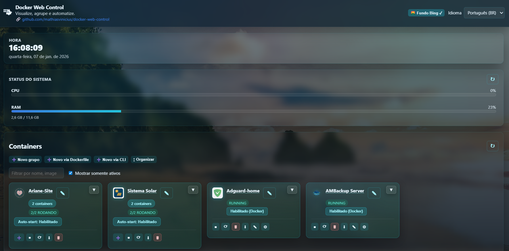
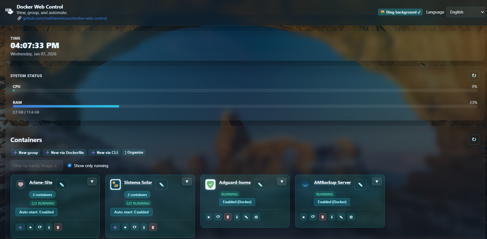

# Docker Web Control

**Visualize, group and automate Docker containers — in a CasaOS‑inspired web UI.**
**Versão atual / Current version: 3.3**


[🇧🇷 Português](#-português) · [🇺🇸 English](#-english)

## 📸 Screenshots

<details open>
<summary><strong>🇧🇷 Português (PT‑BR)</strong></summary>



</details>

<details>
<summary><strong>🇺🇸 English</strong></summary>



</details>

---

## 🇧🇷 Português

### ✨ Destaques

- 🎴 **Cards visuais**: containers individuais + grupos
- ↕ **Organização por arrastar e soltar** (ordem persistida como apelidos/ícones)
- 🧩 **Grupos**: criar, adicionar/remover containers, ações em lote
- 🚀 **Auto-start** por container ou grupo (atualiza restart policy no Docker)
- 🌄 **Fundo Bing opcional** + controle de transparência do painel
- 🕒 **Widgets (CasaOS‑like)**: relógio + status do sistema (CPU/RAM) com Top 10 (containers ou processos)
- 🏷️ **Apelidos, ícones & URLs**: personalize nomes, ícones (com upload) e URLs clicáveis para acesso rápido
- 🧱 **Criar containers** via Dockerfile ou comando CLI
- ✏️ **Editar Container**: Modifique portas, volumes, variáveis, política de reinício, etc.
- 📝 **Editar Dockerfile**: Visualize e edite o Dockerfile do container
- 📦 **Exportar** container/grupo como ZIP
- 🌐 **Idiomas**: PT‑BR e EN

### ✅ Requisitos

- Docker instalado e rodando
- Python 3.10+
- Permissão para executar `docker` (ex.: usuário no grupo `docker`)

### 🚀 Instalação (recomendado: /opt + systemd)

```bash
git clone https://github.com/mathiasvinicius/docker-web-control.git
cd docker-web-control
sudo ./install.sh --system
```

Acesse: `http://localhost:8088`

### 🔄 Atualização

```bash
cd docker-web-control
git pull
sudo ./install.sh --update
```

### ⚙️ Configuração (`.env`)

`server.py` e `autostart.py` carregam `.env` automaticamente (sem sobrescrever variáveis já definidas).

```bash
HOST=0.0.0.0
PORT=8088
DOCKER_TIMEOUT=30
# DEBUG=1
```

### 🗂️ Dados locais

Esses itens são criados automaticamente na primeira execução/instalação.

- `data/` (grupos, apelidos/ícones, ordem dos cards, auto‑start)
- `icons/` (uploads de ícones)
- `dockerfiles/` (Dockerfiles gerados/editados)
- `.env`

### 🧭 Dicas de uso

- **Top CPU/RAM**: clique em **CPU** ou **RAM** no widget “Status do Sistema”.
  - ✅ “Apenas containers” (padrão): usa `docker stats`
  - ⛔ desmarcado: lista processos do sistema (tipo `htop`)
  - Sempre mostra **no máximo 10 itens**

### 📡 API (principais endpoints)

- `GET /api/containers`
- `POST /api/containers/{id}/start|stop|restart|delete`
- `POST /api/containers/{id}/restart-policy`
- `GET /api/containers/{id}/details`
- `POST /api/containers/{id}/update`
- `GET /api/containers/{id}/dockerfile` / `POST /api/containers/{id}/dockerfile`
- `GET /api/groups` / `POST /api/groups`
- `GET /api/networks`
- `GET /api/autostart` / `POST /api/autostart`
- `GET /api/container-aliases` / `POST /api/container-aliases`
- `POST /api/upload-icon`
- `GET /api/bing-wallpaper?mkt=pt-BR|en-US`
- `GET /api/system-stats`
- `GET /api/system-top?scope=containers|processes&sort=cpu|mem&limit=10`

### 🧩 Auto-start no boot (opcional)

Veja o guia: `AUTOSTART_SETUP.md`.

---

## 🇺🇸 English

### ✨ Highlights

- 🎴 **Visual cards**: standalone containers + groups
- ↕ **Drag & drop ordering** (persisted like aliases/icons)
- 🧩 **Groups**: create, add/remove containers, batch actions
- 🚀 **Auto-start** per container or group (updates Docker restart policy)
- 🌄 **Optional Bing wallpaper** + panel transparency control
- 🕒 **CasaOS‑like widgets**: clock + system status (CPU/RAM) with Top 10 (containers or processes)
- 🏷️ **Aliases, icons & URLs**: customize names, icons (with upload) and clickable URLs for quick access
- 🧱 **Create containers** via Dockerfile or CLI command
- ✏️ **Edit Container**: Modify ports, volumes, env vars, restart policy, etc.
- 📝 **Edit Dockerfile**: View and edit the container's Dockerfile
- 📦 **Export** container/group as ZIP
- 🌐 **Languages**: PT‑BR and EN

### ✅ Requirements

- Docker installed and running
- Python 3.10+
- Permission to run `docker` (e.g., user in the `docker` group)

### 🚀 Install (recommended: /opt + systemd)

```bash
git clone https://github.com/mathiasvinicius/docker-web-control.git
cd docker-web-control
sudo ./install.sh --system
```

Open: `http://localhost:8088`

### 🔄 Update

```bash
cd docker-web-control
git pull
sudo ./install.sh --update
```

### ⚙️ Configuration (`.env`)

`server.py` and `autostart.py` load `.env` automatically (without overriding existing env vars).

```bash
HOST=0.0.0.0
PORT=8088
DOCKER_TIMEOUT=30
# DEBUG=1
```

### 🗂️ Local data

These items are created automatically on first run/install.

- `data/` (groups, aliases/icons, card order, auto‑start)
- `icons/` (icon uploads)
- `dockerfiles/` (generated/edited Dockerfiles)
- `.env`

### 🧭 Usage tips

- **Top CPU/RAM**: click **CPU** or **RAM** in the “System status” widget.
  - ✅ “Only containers” (default): uses `docker stats`
  - ⛔ unchecked: shows system processes (htop‑like)
  - Always shows **up to 10 items**

### 📡 API (main endpoints)

- `GET /api/containers`
- `POST /api/containers/{id}/start|stop|restart|delete`
- `POST /api/containers/{id}/restart-policy`
- `GET /api/containers/{id}/details`
- `POST /api/containers/{id}/update`
- `GET /api/containers/{id}/dockerfile` / `POST /api/containers/{id}/dockerfile`
- `GET /api/groups` / `POST /api/groups`
- `GET /api/networks`
- `GET /api/autostart` / `POST /api/autostart`
- `GET /api/container-aliases` / `POST /api/container-aliases`
- `POST /api/upload-icon`
- `GET /api/bing-wallpaper?mkt=pt-BR|en-US`
- `GET /api/system-stats`
- `GET /api/system-top?scope=containers|processes&sort=cpu|mem&limit=10`

### 🧩 Auto-start on boot (optional)

See: `AUTOSTART_SETUP.md`.

---

## 📄 License

MIT — see `LICENSE`.
